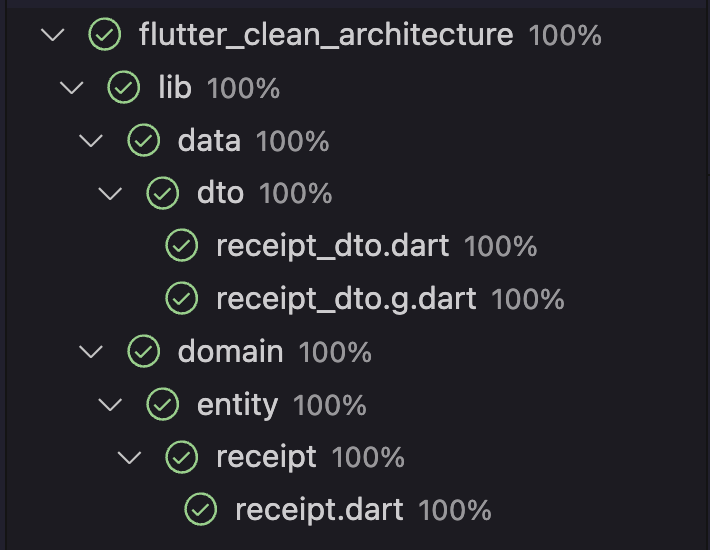

# Flutter Clean Architecture

This project follows the Clean Architecture pattern, which is a software architectural pattern that separates the application logic into three layers: the domain layer, the data layer, and the presentation layer. The main goal of this pattern is to create a clean and maintainable codebase.

## Demo

<video width="300" controls>
  <source src="/media/demo.mp4" type="video/mp4">
</video>

## Justifications

- **Separation of Concerns**: Each layer has a specific responsibility, making it easier to understand and maintain the codebase.
- **Testability**: The domain layer can be easily tested without depending on the presentation layer.
- **Reusability**: The domain layer can be reused in other applications.
- **Simplicity**: The codebase is simpler and easier to understand.

### Folder Structure

``` tree
lib/
├── data
│   ├── dto
│   ├── provider
│   │   └── network
│   │       └── apis
│   └── repository
├── domain
│   ├── entity
│   │   └── receipt
│   ├── repository
│   └── user_case
└── presentation
    └── receipt
        ├── detail
        └── list
            └── view
```

- `data`: This folder contains the data layer of the application. It includes the data transfer objects (DTOs) used to serialize and deserialize data from the API, the network provider that handles the HTTP requests, and the repository that interacts with the data layer.

- `domain`: This folder contains the domain layer of the application. It includes the entity classes that represent the business logic of the application, the repository interfaces that define the contract for interacting with the data layer, and the use cases that encapsulate the business logic of the application.

- `presentation`: This folder contains the presentation layer of the application. It includes the UI components that display the data to the user and handle user interactions.

In summary, the `data` layer handles the communication with the external API, the `domain` layer encapsulates the business logic of the application, and the `presentation` layer handles the user interface.

### State Management

1. **Riverpod**: Riverpod is a state management library for Flutter that provides a reactive and efficient way to manage states in your app. It allows you to define and manage states using providers, which are reactive streams that automatically update when their dependencies change. Riverpod also provides a declarative way to build UI components that are automatically updated when their dependencies change.

2. **GetIt**: GetIt is a service locator that helps you manage dependencies in your app. It allows you to register and resolve dependencies throughout your app. With GetIt, you can easily inject dependencies into your classes, making it easier to test and maintain your code.

By using Riverpod for state management and GetIt as a service locator, you can achieve several benefits:

- **Easy state management**: Riverpod simplifies the process of managing states in your app by providing a declarative way to define and update states.
- **Efficient updates**: Riverpod automatically updates UI components when their dependencies change, making your app more efficient and responsive.
- **Dependency injection**: GetIt helps you manage dependencies in your app, making it easier to test and maintain your code.

Overall, using Riverpod and GetIt together can help you build a more maintainable and efficient Flutter app.

## Testing Strategies

- **Unit Tests**: Test the individual units of code, such as functions and classes, to ensure that they work as expected.
- **Integration Tests**: Test the interaction between different components of the application, such as the domain layer and the data layer.
- **UI Tests**: Test the presentation layer to ensure that it displays the correct data and behaves as expected.
- **End-to-End Tests**: Test the entire application flow to ensure that it works as expected.

### Coverage




## Testing Tools

- **Flutter Test**: The built-in testing framework for Flutter.
- **Mockito**: A mocking framework for Dart.
- **Flutter GoRouter**: A router for Flutter that handles navigation.

## How to Run the Tests

1. Install the necessary dependencies:
   - `flutter pub get`
   - `flutter pub get --override-packages=.`

2. Run the tests:
   - `flutter test`

## How to Contribute

1. Fork the repository.
2. Create a new branch for your changes.
3. Make your changes and run the tests to ensure that everything works as expected.
4. Submit a pull request.
